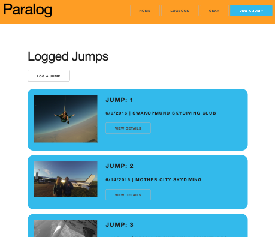

# Unit 2 Project - MEN-Stack CRUD App 

## Technologies Used
#

Node.js, Mongoose, Express, EJS, JavaScript, HTML, CSS 

 

## Installation Instructions 
#

This app is mobile and desktop friendly. Visit the link in your browser of choice and select the "GET STARTED" button on the homepage to start using Paralog. 

 

## User Stories
#

- As the user, I want to be able to keep track of all of my skydives digitally so I can ditch my paper logbook.

- As a follower/fellow skydiver, I want to be able to view someone else's logbook to learn more about their skill level, interests, and gear information to make informed and safe skydiving plans. 

 

## Wireframes 
#

[Click here](https://docs.google.com/presentation/d/1XLfIjMnV5lRC3Ot7cs6q0MmpkkFfBvJ5KLTu5-WMzts/edit?usp=sharing) to view wireframes

 

## Unsolved Problems / Major Hurdles
#

*Hurdles*
- **Mongoose Relationships**: Implementing a relationship between my two schemas was a hurdle. This was more difficult and time consuming than I anticipated but was able to get it working in the end. 
- **Additional Features**: Due to limited time and resources, I wasn't able to implement as many stretch goals listed below. I hope to revisit these later on. 

*Unresolved Stretch Goals* 
- Multer image upload 
- Logbook filter and sorting functionality 
    - Allow user to select sorting criteria 
    - Filter logbook data results to only show certain types of jump documents 

 

## References 
#
Favicon: 
<a target="_blank" href="https://icons8.com/icon/69331/happy-cloud">Happy Cloud</a> icon by <a target="_blank" href="https://icons8.com">Icons8</a>

Nav Bar: <a target="_blank" href="https://www.w3schools.com/howto/howto_css_dropdown_navbar.asp">W3 Schools Dropdown Menu</a>